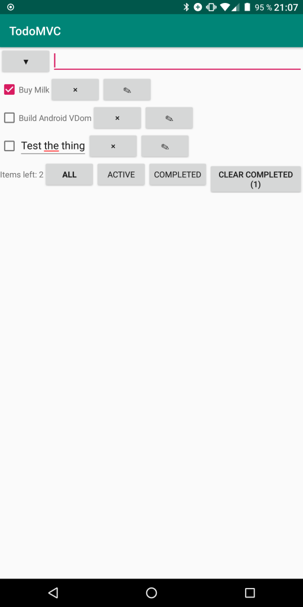

TodoMVC: Purescript on Native Android
=====================================

The repository contains a PoC implementation of TodoMVC on native android.

It is implemented in purescript using the 
kotlin backend [pskt](https://github.com/csicar/pskt).



Structure
---------

```
.
├── android           -- android studio project
│   └── app
│       └── src
│           ├── main  -- kotlin source folder (containing the foreign files and generated files)
│           └── test
└── ps                -- spago project
    ├── output        -- purs compiler output
    │   ├── ...
    │   └── pskt      -- pskt transpiler output (containing .kt files)
    └── src           -- purscript source files
```


Building
--------

Build and copy kotlin files:

```bash
cd ps
spago build && cp -u -a output/pskt/. ../android/app/src/main/java/generated
```

Build & install the app:

```bash
cd android
gradle installDebug
```

or open the `/android` folder in Android Studio and build the app there.